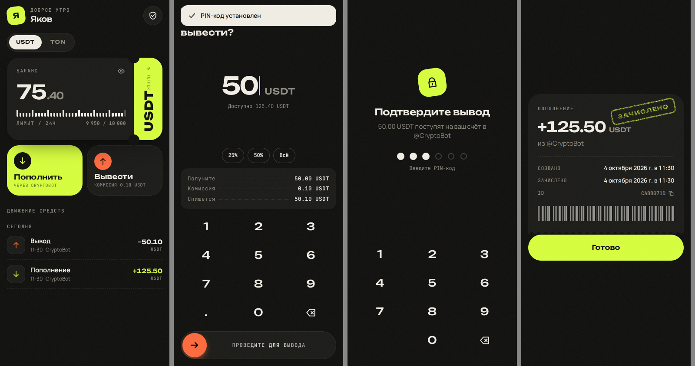
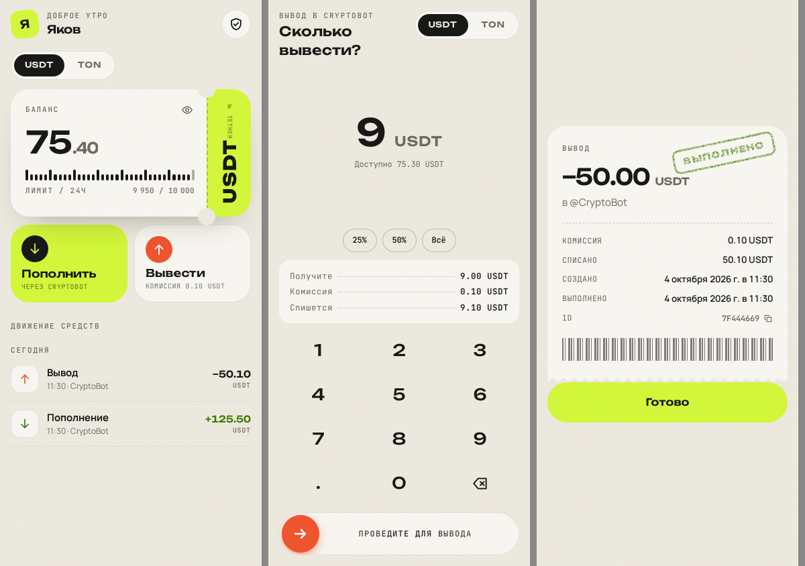

# Кошелёк — Telegram Mini App

Криптокошелёк внутри Telegram: пополнение и вывод USDT/TON через [@CryptoBot (Crypto Pay API)](https://help.crypt.bot/crypto-pay-api), история операций, PIN-код на вывод, уведомления в чат.

```
web/      React 19 + Vite — Mini App (дизайн «билет и штамп»)
server/   Node.js + Fastify + PostgreSQL — API, бот (grammY), фоновые воркеры
```

## Дизайн




Своя визуальная система, а не стандартные компоненты Telegram:

- **Баланс на «билете»** — перфорированная карточка с отрывным корешком, где вертикально напечатан код актива. Цифры баланса прокручиваются, как в механическом счётчике.
- **Шкала суточного лимита**: деления под балансом показывают, сколько ещё можно вывести сегодня.
- **Своя цифровая клавиатура** — системная клавиатура не перекрывает экран, а ввести некорректную сумму невозможно. На каждое нажатие — тактильный отклик.
- **«Проведите для вывода»** — чтобы отправить деньги, нужно протянуть ползунок: случайным касанием вывод не запустить.
- **Квитанции с резиновым штампом** «Зачислено / Выполнено / Отклонено» и оторванным зубчатым краем.
- Тёмная и светлая темы подстраиваются под Telegram, шрифты Unbounded, Manrope и JetBrains Mono, лёгкое «плёночное» зерно на фоне. Учитывается `prefers-reduced-motion`.

## Как работают деньги

| Операция | Поток |
|---|---|
| Пополнение | `POST /api/deposits` → счёт в Crypto Pay → пользователь платит в @CryptoBot → подписанный вебхук `invoice_paid` → зачисление. Если вебхук потерялся, раз в 30 с сверка через `getInvoices` |
| Вывод | Проверка PIN-кода → в одной транзакции блокируются `сумма + комиссия` → `transfer` в Crypto Pay на Telegram-аккаунт пользователя (`spend_id` = id вывода) → `completed`. При явном отказе провайдера всё возвращается на баланс |

**Учёт** ведётся по двойной записи: `accounts` + неизменяемый журнал `ledger_entries`. Сумма проводок каждой транзакции равна нулю, это проверяет триггер при COMMIT. Все суммы хранятся целыми числами в минимальных единицах (`BIGINT`), без float.

## Защита

- **Аутентификация** — подпись Telegram `initData` (HMAC-SHA256, сравнение за постоянное время), проверяется срок жизни `auth_date`. Пароли и сессии не нужны.
- **Нельзя уйти в минус**: списание делается условным `UPDATE … WHERE balance + amount >= 0`, а в БД стоит `CHECK (balance >= 0)`. Тест запускает 8 параллельных выводов и проверяет, что прошли ровно два.
- **Идемпотентность**: заголовок `Idempotency-Key` обязателен для пополнения и вывода. Повтор с тем же ключом возвращает ту же операцию, с другими параметрами — `409`.
- **Исход вывода неизвестен** (таймаут или 5xx): средства остаются заблокированными, воркер сначала проверяет `getTransfers(spend_id)` и только потом повторяет отправку. Crypto Pay принимает каждый `spend_id` один раз, поэтому двойной выплаты не будет. После 5 неудачных попыток вывод уходит на ручную проверку (`review`) и **никогда не возвращается автоматически**.
- **PIN-код** из 6 цифр хранится как scrypt-хеш с солью. Простые коды отклоняются. После 5 ошибок код блокируется на 15 минут, попытки сериализуются блокировкой строки.
- **Вебхуки**: Crypto Pay проверяется по HMAC подписи от сырого тела, Telegram — по `X-Telegram-Bot-Api-Secret-Token`.
- **Лимиты**: минимум и максимум на операцию, суточный лимит вывода (точный, под блокировкой счёта), не больше 5 неоплаченных счетов на пользователя.
- **Ограничение частоты запросов**: 120 в минуту на пользователя, 10 в минуту на денежные операции и PIN.
- Строгий CSP и Helmet, zod-валидация входных данных, лимит размера тела, ошибки без внутренних деталей. Токены и подписи вырезаются из логов. Журнал проводок защищён от UPDATE и DELETE.
- Mock-провайдер в `NODE_ENV=production` запустить нельзя: конфиг отказывается стартовать.

## Запуск

### 1. Подготовка
1. Создайте бота у [@BotFather](https://t.me/BotFather), получите `BOT_TOKEN`. В `/mybots → Bot Settings → Configure Mini App` укажите URL приложения.
2. В [@CryptoBot](https://t.me/CryptoBot) (для тестов — [@CryptoTestnetBot](https://t.me/CryptoTestnetBot)) откройте **Crypto Pay → Create App** и получите токен. В настройках приложения:
   - **Webhooks** → `https://<ваш-домен>/api/webhooks/cryptopay`
   - включите **Transfers**: без этого вывод работать не будет
   - пополните баланс приложения — из него идут выплаты пользователям.
3. Скопируйте `.env.example` в `.env` и заполните.

### 2. Продакшен (Docker)
```bash
docker compose up -d --build
```
Перед контейнером нужен TLS-прокси (Caddy или nginx) с HTTPS: Telegram открывает Mini App только по https. Миграции применяются автоматически при старте.

### 3. Локальная разработка
```bash
npm ci
# Postgres: docker compose up -d db  (или свой), затем в .env:
#   NODE_ENV=development  PAYMENT_PROVIDER=mock  BOT_MODE=off  PUBLIC_URL=http://localhost:3000
npm run dev:server                       # API на :3000
npm run dev:initdata -w server           # подписанный initData для браузера
echo "VITE_DEV_INIT_DATA=<вывод>" > web/.env.local
npm run dev:web                          # Mini App на :5173
```
С mock-провайдером кнопка «Открыть счёт» ведёт на тестовую страницу оплаты.

### Тесты
```bash
TEST_DATABASE_URL=postgres://postgres@localhost:5432/wallet_test npm test
```
Интеграционные тесты идут на настоящем PostgreSQL. Они покрывают гонки, идемпотентность, повторные вебхуки, возвраты, неизвестный исход вывода, блокировку PIN, лимиты, частоту запросов и инварианты журнала. Тесты, проверка типов и сборка также запускаются в GitHub Actions (`.github/workflows/ci.yml`).

## Настройка

Переменные окружения описаны в `.env.example`. Лимиты и комиссии по активам задаются в `server/src/domain/assets.ts`:

| Актив | Пополнение | Вывод | Комиссия | В сутки |
|---|---|---|---|---|
| USDT | 1 – 10 000 | 2 – 5 000 | 0.1 | 10 000 |
| TON | 0.5 – 5 000 | 1 – 2 000 | 0.02 | 4 000 |

## API

Все запросы `/api/*` передают заголовок `Authorization: tma <initData>`.

| Метод | Путь | |
|---|---|---|
| GET | `/api/me` | профиль, балансы, активы, лимиты |
| GET | `/api/history?cursor=` | история операций (keyset-пагинация) |
| POST | `/api/deposits` | `{asset, amount}` + `Idempotency-Key` → счёт |
| GET | `/api/deposits/:id` | статус пополнения |
| POST | `/api/withdrawals` | `{asset, amount, pin}` + `Idempotency-Key` |
| GET | `/api/withdrawals/:id` | статус вывода |
| POST | `/api/pin`, `/api/pin/change` | установка и смена PIN |
| POST | `/api/webhooks/cryptopay` | вебхук Crypto Pay (подпись) |
| GET | `/api/health` | проверка живости |

## Перед запуском в прод

- [ ] `CRYPTOPAY_NETWORK=mainnet`, токен основного приложения, включены Transfers, на балансе приложения есть средства
- [ ] `BOT_MODE=webhook`, задан длинный случайный `TELEGRAM_WEBHOOK_SECRET`
- [ ] HTTPS, `TRUST_PROXY=true` за прокси
- [ ] Резервные копии PostgreSQL
- [ ] Мониторинг логов с `withdrawal moved to manual review` и `paid invoice does not match deposit`: это ситуации для ручного разбора
- [ ] При нескольких репликах счётчики частоты запросов нужно перенести в Redis (`@fastify/rate-limit` поддерживает это из коробки). Воркеры к нескольким репликам уже готовы
